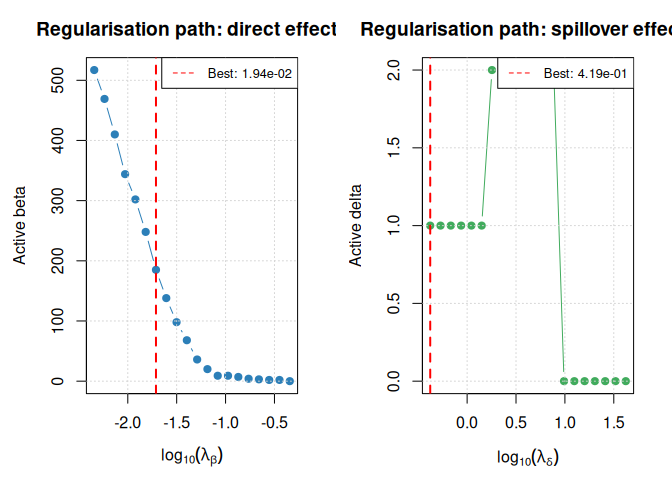
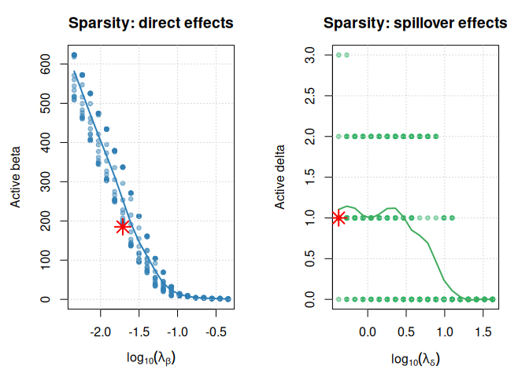
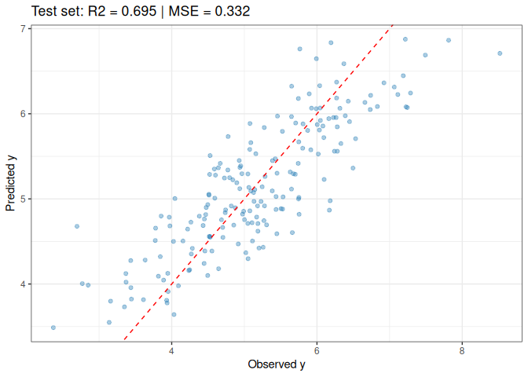

# heritage — Simulation Study: Scenario 1 (High Dimensionality)
Abdoul Oudouss Diakite, Anne-Marie Madore, Celia M. T.
Greenwood, Catherine Laprise
2026-06-05

## Overview

This document reproduces **Simulation Scenario 1 (High Dimensionality)**
from the HERITAGE paper. The goal is to evaluate the model’s ability to
correctly identify direct and spillover genetic effects as the number of
variants $d$ grows much larger than the sample size $N$.

### Scenario parameters (from the paper)

| Parameter | Value |
|----|----|
| Pedigree | 4 generations, 250 founders ($F_0$), litter size 2 |
| Sample size | $N \approx 1000$ (stochastic) |
| Dimensionality $d$ | 1000 (default; varied as 200, 500, 1000, 2000, 5000) |
| Active direct effects $|S_\beta|$ | 15 |
| Active spillover effects $|S_\delta|$ | 9 |
| True coefficients | $\beta_j \sim \mathcal{N}(0,\,0.5^2)$, $\delta_j \sim \mathcal{N}(0,\,0.3^2)$ |
| Error | $\varepsilon_i \sim \mathcal{N}(0,\,0.5^2)$ |
| Data split (by family) | 60 % train / 20 % tune / 20 % test |

### Statistical model

$$
y_i = \alpha + \boldsymbol{\beta}^\top x_i +
      \boldsymbol{\delta}^\top s_X^{(i)} + \varepsilon_i,
\qquad
s_X^{(i)} = \frac{\sum_{j \in \mathrm{Anc}(i)} \phi_{ij}\, x_j}
                  {\sum_{j \in \mathrm{Anc}(i)} \phi_{ij}}
$$

with the hierarchical sparsity constraint
$\mathrm{supp}(\boldsymbol{\delta}) \subseteq \mathrm{supp}(\boldsymbol{\beta})$.

------------------------------------------------------------------------

## Setup

``` r
suppressPackageStartupMessages({
  library(pedSimulate)
  library(kinship2)
  library(heritage)
  library(ggplot2)
  library(dplyr)
})

set.seed(2026)
```

------------------------------------------------------------------------

## Step 1 — Simulate the pedigree

Following the paper: 4-generation pedigree starting from 250 founders,
litter size 2, random mate selection.

``` r
N_FOUNDERS    <- 250
N_GENERATIONS <- 4
LITTER_SIZE   <- 2

ped_raw <- simulatePed(
  F0size     = N_FOUNDERS,
  Va0        = 1,
  Ve         = 1,
  littersize = LITTER_SIZE,
  ngen       = N_GENERATIONS,
  fsel       = "R",
  msel       = "R"
)

pedigree_df <- data.frame(
  id   = ped_raw$ID,
  dam  = ped_raw$DAM,
  sire = ped_raw$SIRE,
  gen  = ped_raw$GEN,
  sex  = ifelse(ped_raw$SEX == "m", 1L, 2L)
)

N <- nrow(pedigree_df)
cat(sprintf("Total individuals : N = %d\n", N))
```

    Total individuals : N = 1162

``` r
cat(sprintf("Generations       : %d\n", max(pedigree_df$gen)))
```

    Generations       : 4

``` r
table(pedigree_df$gen)
```


      0   1   2   3   4 
    250 250 236 208 218 

------------------------------------------------------------------------

## Step 2 — Simulate genotypes

Allele frequencies are drawn uniformly from $[0.01, 0.99]$ and genotypes
are propagated according to Mendelian laws via
`pedSimulate::simulateGen()`.

``` r
D        <- 1000
AF       <- runif(D, min = 0.01, max = 0.99)
mut_rate <- rep(0, D)

ped_for_sim <- data.frame(
  ID   = pedigree_df$id,
  SIRE = pedigree_df$sire,
  DAM  = pedigree_df$dam
)

X <- as.matrix(simulateGen(ped_for_sim, AF, mut_rate))

cat(sprintf("Genotype matrix : %d x %d\n", nrow(X), ncol(X)))
```

    Genotype matrix : 1162 x 1000

``` r
cat(sprintf("AF range        : [%.3f, %.3f]\n",
            min(colMeans(X) / 2), max(colMeans(X) / 2)))
```

    AF range        : [0.007, 0.999]

------------------------------------------------------------------------

## Step 3 — Compute the kinship matrix

``` r
K <- as.matrix(kinship(
  id    = pedigree_df$id,
  dadid = pedigree_df$sire,
  momid = pedigree_df$dam
))

cat(sprintf("Kinship matrix : %d x %d\n", nrow(K), ncol(K)))
```

    Kinship matrix : 1162 x 1162

------------------------------------------------------------------------

## Step 4 — Build the ancestor list

Using `build_ancestor_list()` from the `heritage` package, which
recursively traverses the pedigree for each individual via
`find_ancestors()`.

``` r
ancestors <- build_ancestor_list(pedigree_df, verbose = FALSE)

n_founders <- sum(lengths(ancestors) == 0L)
cat(sprintf("Founders (no ancestors) : %d\n", n_founders))
```

    Founders (no ancestors) : 250

``` r
cat(sprintf("Non-founders            : %d\n", N - n_founders))
```

    Non-founders            : 912

------------------------------------------------------------------------

## Step 5 — Compute the spillover matrix $s_X$

``` r
sX <- compute_spillover_X(X, K, ancestors)

cat(sprintf("Individuals with non-zero spillover: %.1f%%\n",
            100 * mean(rowSums(abs(sX)) > 0)))
```

    Individuals with non-zero spillover: 78.5%

------------------------------------------------------------------------

## Step 6 — Generate the outcome

True coefficients are fixed across replications; only $\varepsilon$
varies.

``` r
N_CAUSAL_BETA  <- 15L
N_CAUSAL_DELTA <- 9L
ALPHA_TRUE     <- 1.0
NOISE_SD       <- 0.5

set.seed(1000)
causal_beta  <- sort(sample(D, N_CAUSAL_BETA))
causal_delta <- sort(sample(causal_beta, N_CAUSAL_DELTA))

beta_true  <- numeric(D)
delta_true <- numeric(D)
beta_true[causal_beta]   <- rnorm(N_CAUSAL_BETA,  sd = 0.5)
delta_true[causal_delta] <- rnorm(N_CAUSAL_DELTA, sd = 0.3)

set.seed(2026)
eta <- ALPHA_TRUE + X %*% beta_true + sX %*% delta_true
y   <- as.vector(eta) + rnorm(N, sd = NOISE_SD)

cat(sprintf("y: mean = %.3f | sd = %.3f | range = [%.2f, %.2f]\n",
            mean(y), sd(y), min(y), max(y)))
```

    y: mean = 4.782 | sd = 1.236 | range = [0.94, 8.52]

``` r
cat(sprintf("|S_beta|  = %d\n", sum(beta_true  != 0)))
```

    |S_beta|  = 15

``` r
cat(sprintf("|S_delta| = %d\n", sum(delta_true != 0)))
```

    |S_delta| = 9

``` r
cat(sprintf("supp(delta) subset supp(beta) : %s\n",
            all(which(delta_true != 0) %in% which(beta_true != 0))))
```

    supp(delta) subset supp(beta) : TRUE

``` r
cat(sprintf("Oracle R2 (signal / variance) : %.3f\n",
            var(as.vector(eta)) / var(y)))
```

    Oracle R2 (signal / variance) : 0.870

------------------------------------------------------------------------

## Step 7 — Split data by family

Data are partitioned **by family** (60 % train / 20 % tune / 20 % test)
to prevent data leakage, following the paper’s protocol.

``` r
family_id <- paste(pedigree_df$dam, pedigree_df$sire, sep = "-")
families  <- unique(family_id)

set.seed(42)
fam_perm <- sample(families)
n_fam    <- length(families)
n_train  <- round(0.60 * n_fam)
n_tune   <- round(0.20 * n_fam)

fam_train <- fam_perm[seq_len(n_train)]
fam_tune  <- fam_perm[(n_train + 1L):(n_train + n_tune)]
fam_test  <- fam_perm[(n_train + n_tune + 1L):n_fam]

idx_train <- which(family_id %in% fam_train)
idx_tune  <- which(family_id %in% fam_tune)
idx_test  <- which(family_id %in% fam_test)

cat(sprintf("Train : %d individuals (%d families)\n",
            length(idx_train), length(fam_train)))
```

    Train : 793 individuals (349 families)

``` r
cat(sprintf("Tune  : %d individuals (%d families)\n",
            length(idx_tune),  length(fam_tune)))
```

    Tune  : 179 individuals (116 families)

``` r
cat(sprintf("Test  : %d individuals (%d families)\n",
            length(idx_test),  length(fam_test)))
```

    Test  : 190 individuals (117 families)

### Standardise on training set parameters

``` r
mu_X <- colMeans(X[idx_train, ])
sd_X <- apply(X[idx_train, ], 2, sd)
sd_X[sd_X < 1e-10] <- 1

scale_mat <- function(mat, mu, s)
  sweep(sweep(mat, 2, mu, "-"), 2, s, "/")

X_train  <- scale_mat(X[idx_train,  ], mu_X, sd_X)
X_tune   <- scale_mat(X[idx_tune,   ], mu_X, sd_X)
X_test   <- scale_mat(X[idx_test,   ], mu_X, sd_X)

sX_train <- scale_mat(sX[idx_train, ], mu_X, sd_X)
sX_tune  <- scale_mat(sX[idx_tune,  ], mu_X, sd_X)

sX_test  <- scale_mat(sX[idx_test,  ], mu_X, sd_X)

y_train  <- y[idx_train]
y_tune   <- y[idx_tune]
y_test   <- y[idx_test]
```

------------------------------------------------------------------------

## Step 8 — Fit HERITAGE with grid search

``` r
gs <- heritage_gs(
  y_train  = y_train,  X_train  = X_train,  sX_train  = sX_train,
  y_tune   = y_tune,   X_tune   = X_tune,   sX_tune   = sX_tune,
  y_test   = y_test,   X_test   = X_test,   sX_test   = sX_test,
  family         = "gaussian",
  n_lambda_beta  = 20,
  n_lambda_delta = 20,
  metric         = "mse",
  verbose        = FALSE
)

print(gs)
```

    HERITAGE -- Grid Search Results
    ============================================================

    Family           : gaussian
    Optimised metric : mse

    Best lambda_beta : 1.9420e-02
    Best lambda_delta: 4.1938e-01

    Tuning set metrics:
      mse             : 0.269924
      rmse            : 0.519542
      mae             : 0.413939
      r2              : 0.651106

    Test set metrics:
      mse             : 0.332400
      rmse            : 0.576541
      mae             : 0.467005
      r2              : 0.694733

    Best model: 185 active beta, 1 active delta

------------------------------------------------------------------------

## Step 9 — Diagnostics

### Regularisation paths

``` r
plot(gs, type = "paths")
```

<div id="fig-paths">



Figure 1: Number of active coefficients as a function of each penalty.

</div>

### Sparsity

``` r
plot(gs, type = "sparsity")
```

<div id="fig-sparsity">



Figure 2: Active coefficient counts across all grid combinations.

</div>

------------------------------------------------------------------------

## Step 10 — Performance metrics

``` r
best  <- gs$best_model
y_hat <- predict(best, newX = X_test, newsX = sX_test, type = "response")

mse_test <- mean((y_test - y_hat)^2)
r2_test  <- 1 - sum((y_test - y_hat)^2) / sum((y_test - mean(y_test))^2)
mae_test <- mean(abs(y_test - y_hat))

cat(sprintf("MSE : %.4f\n", mse_test))
```

    MSE : 0.3324

``` r
cat(sprintf("R2  : %.4f\n", r2_test))
```

    R2  : 0.6947

``` r
cat(sprintf("MAE : %.4f\n", mae_test))
```

    MAE : 0.4670

### Observed vs predicted

``` r
ggplot(data.frame(obs = y_test, pred = y_hat),
       aes(x = obs, y = pred)) +
  geom_point(alpha = 0.4, size = 1.5, colour = "#2c7fb8") +
  geom_abline(slope = 1, intercept = 0,
              colour = "red", linetype = "dashed") +
  labs(x = "Observed y", y = "Predicted y",
       title = sprintf("Test set: R2 = %.3f | MSE = %.3f",
                       r2_test, mse_test)) +
  theme_bw()
```

<div id="fig-obs-pred">



Figure 3: Observed vs predicted values on the test set.

</div>

------------------------------------------------------------------------

## Reference

Abdoul Oudouss Diakite, Anne-Marie Madore, Celia M. T. Greenwood,
Catherine Laprise (2026). HERITAGE: Hierarchical effects regression with
interactions for trait analysis in genetics. *Manuscript in
preparation.*
